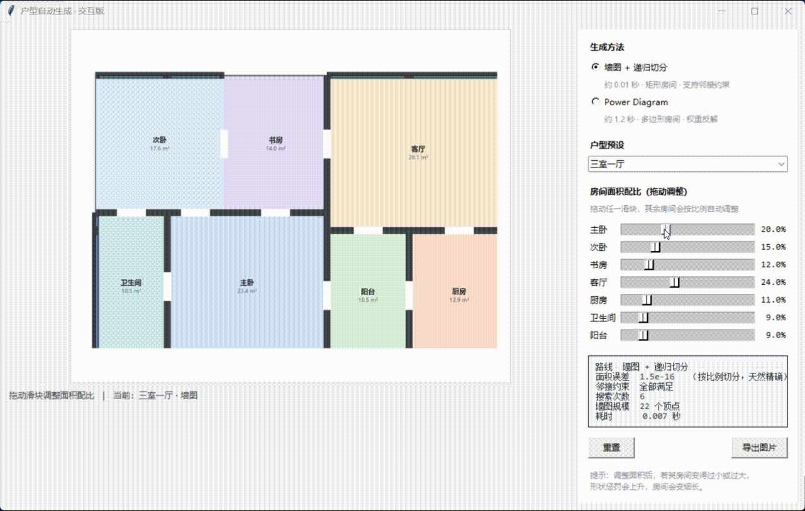

# 户型自动生成：两条技术路线的实现与对比

用两种方法自动生成户型平面图，并做定量对比：

| | 路线 A：Power Diagram | 路线 B：墙图 + 递归切分 |
|---|---|---|
| **原理** | 加权 Voronoi，权重控制区域大小 | 按面积比例递归切分矩形 |
| **房间形状** | 不规则多边形，边数不定 | **全部为矩形，横平竖直** |
| **面积控制** | 反馈迭代反解权重 | 按比例切分，**天然精确** |
| **约束支持** | 未实现 | **可满足邻接约束** |
| **外接矩形填充率** | 0.742 | **1.000** |



---

## 一、关于 WallPlan（先说清楚边界）

路线 B 参考的是 **WallPlan**（ACM TOG / SIGGRAPH 2022，41(4)）的核心思想，
作者为孙嘉辉、**吴文明（通讯）**、刘利刚、闵文杰、张高峰、郑利平，
合肥工业大学为第一完成单位。

**WallPlan 实际做的是**：
- 把户型表示为**带房间标签的墙图**（wall graph）
- 用**神经网络**生成这张图：WinNet 预测窗户、GraphNet 生成几何、LabelNet 预测语义，
  三者自回归交替工作，像图遍历一样把户型"长"出来
- 在 **RPLAN 数据集**（8 万余张真实户型图）上训练
- 支持承重墙、门窗、气泡图等设计约束

**本项目实现了什么、没实现什么**：

| | 状态 |
|---|---|
| 墙图表示（顶点=墙交点，边=墙段，面=房间） | ✅ 已实现 |
| 邻接约束（气泡图约束的简化版） | ✅ 已实现 |
| 递归切分生成器 | ✅ 已实现（**非学习**方法） |
| 神经网络生成（WinNet / GraphNet / LabelNet） | ❌ **未复现** |
| RPLAN 数据集训练 | ❌ **未复现** |

**为什么没复现神经网络部分**：需要 RPLAN 数据集授权，且训练需要 GPU；
本项目在无独显的环境下完成，因此选择把论文的**表示方法**落地，
再用经典的递归切分来生成，而不是假装复现了整个系统。

> **如果你要引用 WallPlan，请注意它用的是图生成网络，不是计算几何方法。**
> 本项目的路线 B 只借用了它的"墙图"表示思路。

---

## 二、路线 A：Power Diagram

### 原理

| | 归属判据 | 特点 |
|---|---|---|
| Voronoi | 到站点**距离**最小 | 区域大小完全由位置决定，不可控 |
| **Power Diagram** | **功率距离**最小，= 距离² − 权重 | 多一个权重，可独立调节大小 |

权重增大 → 该区域膨胀 → 面积变大。**面积是权重的单调递增函数**，所以可以反解。

### 面积反解

```
重复:
    算一遍 Power Diagram，量出各区域实际面积
    误差 = 目标面积 - 实际面积；面积偏小就加大权重，偏大就减小
直到误差收敛
```

两个关键细节：
1. **学习率随迭代衰减** —— 前期快速逼近，后期细调，避免震荡
2. **每步把权重减去均值** —— 权重整体平移不改变划分结果，不归一化会数值不稳

### 结果

| 户型 | 套内面积 | 房间数 | 面积误差 | 外接矩形填充率 |
|---|---|---|---|---|
| 一室一厅 | 63.0 m² | 5 | 0.000241 | 0.734 |
| 两室一厅 | 93.5 m² | 6 | 0.000109 | 0.742 |
| 三室一厅 | 117.0 m² | 7 | 0.000196 | 0.801 |

等权重（Voronoi）误差 0.1252 → 优化权重 0.000109，**改善约 1149 倍**。

**填充率只有 0.73～0.80**，说明房间是斜边的多边形——填不满自己的外接矩形。
**这正是"为什么房间是不规则五边形"的定量解释。**

---

## 三、路线 B：墙图 + 递归切分

### 原理

把户型外轮廓按**面积比例递归切分**：每一步选一个房间分组，
按两组面积之比切一刀，然后对两半递归。

**为什么面积天然精确**：每一步都按"两组面积之比"来切，
子矩形面积严格等于该组的总需求，递归下去每个叶子自然拿到目标面积——
**不需要任何迭代反解**。

切分方向（横切/竖切）和切在第几个房间，用**长宽比惩罚**来挑最优的一组。

### 邻接约束

递归切分的结果**依赖房间的排列顺序**——谁先切谁就占左上，
而顺序决定了谁和谁相邻。所以对房间顺序做**随机搜索**：

```
评分 = 约束违反数 × 50 + 房间长宽比偏离之和
```

跑若干次随机排列，取评分最低的。这就是 WallPlan 论文里
"支持气泡图约束"的简化版——**论文用神经网络学出来，这里用搜索凑出来**。

### 结果

| 户型 | 面积误差 | 约束违反 | 搜索次数 | 耗时 | 墙图规模 |
|---|---|---|---|---|---|
| 一室一厅 | **0.000000** | **0** | 3 | 0.00 s | 16 顶点 / 18 边 |
| 两室一厅 | **0.000000** | **0** | 3 | 0.00 s | 20 顶点 / 20 边 |
| 三室一厅 | **0.000000** | **0** | 6 | 0.00 s | 22 顶点 / 23 边 |

生成图包含：矩形房间、加粗墙体、内墙上的门洞、外墙上的窗户符号、房间名与面积。

---

## 四、怎么运行

```bash
python app.py             # 交互程序（拖动滑块实时调整面积）
python run.py             # 跑全部五组实验，生成所有结果图和数据
python make_report.py     # 生成 Word 实验报告
```

### 交互程序 `app.py`

用 **Tkinter**（Python 自带，不需安装任何东西）。界面分两栏：

- **左侧**：户型图，随操作实时刷新
- **右侧**：生成方法切换、户型预设下拉、**每个房间一个面积滑块**、实时指标、导出按钮

**拖动任一滑块调整该房间的面积配比**，其余房间按比例自动调整，户型图立即重算。

两条路线在交互性上的差别很直接：

| | 墙图 + 递归切分 | Power Diagram |
|---|---|---|
| 单次生成 | **0.006 秒** | 0.27 秒（降配）／1.2 秒（全质量） |
| 交互策略 | 拖动即刷新，无延迟 | 拖动时用降配参数预览，**松手后自动补一张全质量图** |
| 房间形状 | 矩形，横平竖直 | 不规则多边形 |

指标面板会实时显示：面积误差、邻接约束满足情况、搜索次数、墙图规模、耗时。

**依赖**：`numpy`、`Pillow`（画报告用 `python-docx`）。**纯 CPU，不需要显卡。**

单独用：

```python
import wallgraph, floorplan

# 路线 B：墙图
fp = wallgraph.generate('两室一厅')
wallgraph.render(fp['rooms'], fp['size'], title='两室一厅').save('b.png')

# 路线 A：Power Diagram
fp = floorplan.generate('两室一厅')
floorplan.render(fp, title='两室一厅').save('a.png')
```

---

## 五、开发中发现的问题 ⭐

### 5. 报告的数字和实际算的不是一回事

**现象**：给交互程序加上"自定义面积"入口后，拖动滑块调整面积，
图**画对了**，但指标面板上报的"目标占比"还是**预设值**。

**原因**：生成逻辑改好了，但返回结果里那行报元数据的代码没跟着改：

```python
return dict(..., targets={n: a for n, a, _ in cfg['rooms']}, ...)   # 还是预设值
```

**修法**：改成返回实际使用的目标值 `{n: a for n, a in base}`。

> **教训**：这是一个**元数据与实际计算脱节**的 bug —— 算得对，但报得不对。
> 在科研里这比算错更危险：图表和结论引用的是元数据，
> **报告里的数字和你实际跑的东西不是一回事，而这种错误不会报错、不会崩溃**，
> 只能靠"每个数字都能追到来源"的习惯来防。

### 6. 界面右侧的面板整个挤没了

**现象**：交互程序右侧的控制面板被挤出窗口，看不见。

**原因**：Tkinter 的 `pack` 按**调用顺序**分配空间。左边画布用了
`expand=True`（占据剩余空间），而它**先**被 pack，于是它把空间全占了，
后 pack 的右侧面板就没地方了。

**修法**：把固定宽度的右侧面板**先** pack，再 pack 可伸缩的左侧。

> **教训**：布局的分配顺序会决定谁能拿到空间。
> 凡是"固定尺寸 + 可伸缩"混排，一律先放固定尺寸的那个。

### 附：一个不是程序的问题

用脚本截图验证界面时，抓到的图总是偏的。排查后确认是
**Tk 报的坐标是逻辑坐标、而屏幕有 1.5 倍 DPI 缩放**，两者不一致。
这不是程序的问题，是验证手段的问题——最后改为直接抓全屏才看准。

### 1. 门洞开到了外墙上

**现象**：门有一部分出现在户型的**外轮廓**上，而门理应只开在内墙上。

**原因**：膨胀操作里用了 `np.roll`，而 **`np.roll` 是环绕的**——
它把图像另一侧的内容卷了过来。于是贴着外墙的房间在边缘处"看见"了
从对面卷过来的邻居，误判为有公共边界，就把门开到了外墙上。

**修法**：膨胀前先 `padding`，环绕进来的就都是空值；再限制门洞只能开在距外墙一定距离处。

> **`np.roll` 的语义是"循环移位"，不是"平移"。** 做图像空间操作时不留神，
> 就会引入这种看起来毫无道理的边界错误。

### 2. 生成一张户型要 14 秒

**现象**：权重优化迭代 300 次，每次都跑全分辨率（900×587）。

**原因**：迭代中只需要**面积比例**，这个量在低分辨率下已经足够精确。

**修法**：优化在低分辨率（220 px）上做，收敛后用最终权重按全分辨率重算标签图。
出图精度不受影响，**耗时 14.2 秒 → 1.1 秒**。

### 3. 收敛曲线剧烈震荡

**现象**：面积误差在 0.2 到 0.9 之间来回跳，曲线像心电图。

**原因**：反馈增益过大。实测学习率 1.2 时误差最大冲到 **0.88**——
比初始误差 0.125 还大 7 倍。

| 学习率 | 最大误差 | 是否超调 | 最终误差 |
|---|---|---|---|
| 1.2 | 0.8767 | **是（7 倍）** | 0.001551 |
| 0.6 / 0.4 / 0.25 | 0.1253 | 否 | 0.001551 |

**修法**：学习率降到 0.4。

> **教训**：增益过大时系统不是"收敛得慢"，而是**直接发散**。
> 而且最终仍收敛到同一个值——**只看最终误差根本发现不了**。

### 4. 邻接约束一开始全部违反

**现象**：路线 B 第一版生成后，"卫生间必须挨着主卧""阳台必须挨着客厅"全部没满足。

**原因**：递归切分的结果依赖房间排列顺序，而顺序决定了谁和谁相邻。
按预设顺序切，邻接关系是"撞出来的"，不是设计出来的。

**修法**：对房间顺序做随机搜索，以"约束违反数 + 形状惩罚"为评分。
实测 **3～6 次就找到满足全部约束的解**——搜索空间比想象中小得多，
因为大部分随机顺序都能满足约束，只有少数会违反。

---

## 六、文件说明

| 文件 | 作用 |
|---|---|
| `powerdiagram.py` | 路线 A 核心：Power Diagram 计算、面积反解 |
| `floorplan.py` | 路线 A：户型预设、渲染 |
| `wallgraph.py` | 路线 B 核心：墙图表示、递归切分、约束搜索、渲染 |
| `run.py` | 五组实验，产出所有结果图与数据 |
| `make_report.py` | 生成 Word 报告（依赖 python-docx） |

运行后会在 `output/` 下生成全部结果图与数据，并更新 `实验结果.md`。

---

## 七、已知局限与可扩展方向

**路线 A**
1. 只优化权重，站点位置由预设给定；完整做法应同时优化位置与权重
2. 没有采光、朝向、通行流线等建筑约束
3. 不规则多边形不符合建筑制图习惯

**路线 B**
1. 递归切分只能产生"一刀到底"的划分，非矩形场地需要扩展
2. 邻接约束用随机搜索满足，房间数多于 10 个时可能搜索不完备
3. 门洞位置取公共墙中点，没有考虑通行合理性

**共同**
1. 均未使用真实户型数据，房间面积配比来自经验设定
2. 若要接近 WallPlan 的水平，需要引入 RPLAN 数据集与学习方法
